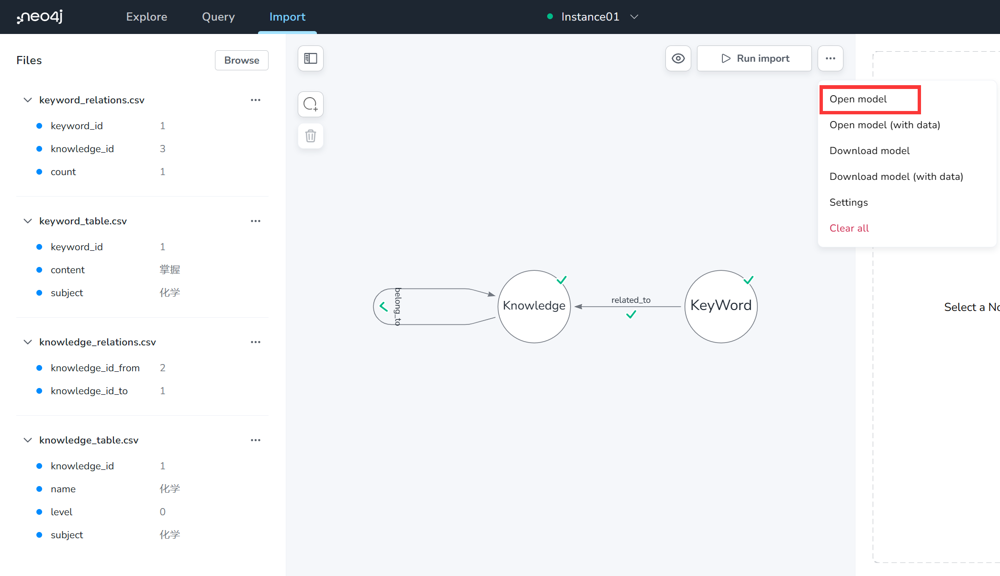

# 试题知识点推荐系统  

 **目录**

* [1. 任务介绍](#任务介绍)
* [2. 代码结构说明](#代码结构说明)
* [3. 环境准备](#环境准备)
* [4. 数据准备](#数据准备)
* [5. 系统功能测试](#系统功能测试)

<a name="任务介绍"></a>

## 1.任务介绍
本系统的主要功能是输入一段试题文本，输出与之相关的知识点。
实现方法可以简单地描述为：通过解析word文档中的知识点，再使用Neo4j数据库构建知识图谱，最后设计了一套算法从构建好的知识图谱中找到与输入试题相关的知识点。
除此之外，系统附带实现知识图谱的管理功能。

关于实现原理，详见[论文](./PDF/论文.pdf)。

<a name="代码结构说明"></a>

## 2. 代码结构说明
```
|—— config # 配置文件存放目录
    |—— db_config.json  # 数据库配置文件
    |—— keyword_config.json  # 关键词抽取模块配置文件
    |—— global_config.json # 全局配置文件
    |—— doc_config # 文档配置文件目录，可以在全局配置文件中修改
|—— csv # 存放用于构建知识图谱的 csv 文件
|—— doc # 存放需要解析的 word 文档
|—— PDF # 存放论文 PDF 文件
|—— graph_database
    |—— connect.py  # 连接neo4j数据库
|—— knowledge_graph
    |—— doc_control_flow.py  # 文档控制流
    |—— keyword.py  # 文本关键词抽取模块，基于paddlenlp和正则表达式联合抽取
    |—— kg_managment.py  # 实现知识图谱管理功能
    |—— parse_config.py  # 解析配置文件
    |—— read_images.py  # 基于OCR技术提取图片中的文字
|—— recommender
    |—— kf_ikf.py  # 推荐算法实现
|—— flask_server.py  # 使用 flask 框架实现的服务端
|—— test_client.ipynb  # 使用 jupyter 对服务端功能测试
|—— generate_kg_table.py  # 生成构建知识图谱的关系表的脚本，生成文件放在./csv目录中
```

<a name="环境准备"></a>

## 3. 环境准备

推荐使用GPU进行训练，在预测阶段使用CPU或者GPU均可。

**环境依赖**
* neo4j~=5.8.1
* pandas~=2.0.0
* numpy~=1.23.2
* paddlepaddle-gpu==2.4.2.post117
* paddleocr==2.6.1.3
* paddlenlp==2.5.2
* Flask~=2.2.3
* jupyter
* mammoth==1.5.1
* beautifulsoup4~=4.12.2

```
pip install -r requirements.txt
```

## 4. 数据准备

下载[文档文件](https://drive.google.com/file/d/1HAKwnfroABdrLhxOEnArIJ-MWnz2vS6V/view?usp=drive_link)(Google Driver 需要访问外网)，并解压到./csv目录下。

在项目目录下运行下面的命令用于生成构建知识图谱的数据表(csv文件):
```
python generate_kg_table
```
在[Aura](https://neo4j.com/cloud/platform/aura-graph-database/?ref=neo4j-home-hero)创建一个免费的Neo4j实例，然后在”import“页面中导入模型，
具体做法是点击红框中的按钮，导入”./csv”目录下的“neo4j_importer_model.json”文件。



然后点在左侧的“Files”一栏中点击“Browse”按钮导入”./csv”目录下的csv数据表文件。最后Run Import自动导入数据。

<a name="任务介绍"></a>

## 5.系统功能测试

在本地启动服务器：
```
python -m flask --app flask_server run
```
在“test_client.ipynb”中测试系统功能
